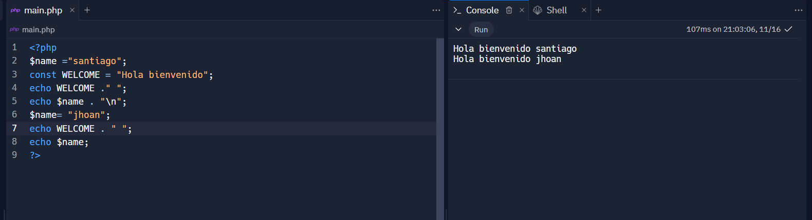

<h1>taller 10 - jhoan santiago roa lugo </h1>
<h2>informacion</h2>

curso: full stack basico - grupo 1

profesor: cristian patiño

<h2>punto 1: constantes y variables</h2>

<h2>punto 2: sumas y constantes</h2>

<h2>punto 3: suma de dos números indicados por el usuario</h2>

<h2>punto 4: datos del usuario en consola</h2>

<h2>punto 5: entrada de bolera usando if/else</h2>

<h2>punto 6: deteccion de mayoria de edad</h2>

<h2>punto 7: seleccion de operación aritmetica</h2>

<h2>punto 8: entrada de la bolera usando switch</h2>

<h2>punto 9: tabla de multiplicar usando while</h2>

<h2>punto 10: números pares usando while</h2>

<h2>punto 11: números impares usando for</h2>

<h2>punto 12: tabla de multiplicar usando for</h2>

<h2>punto 13: suma de valores de un arreglo usando foreach</h2>

<h2>punto 14: revision de contraseña</h2>

<h2>punto 15: seleccion de operación aritmetica usando funcionesa</h2>

